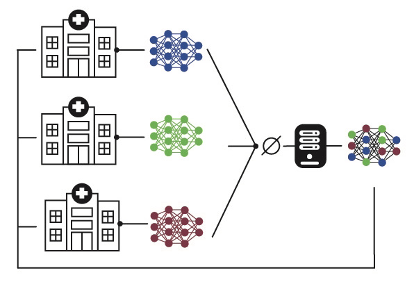
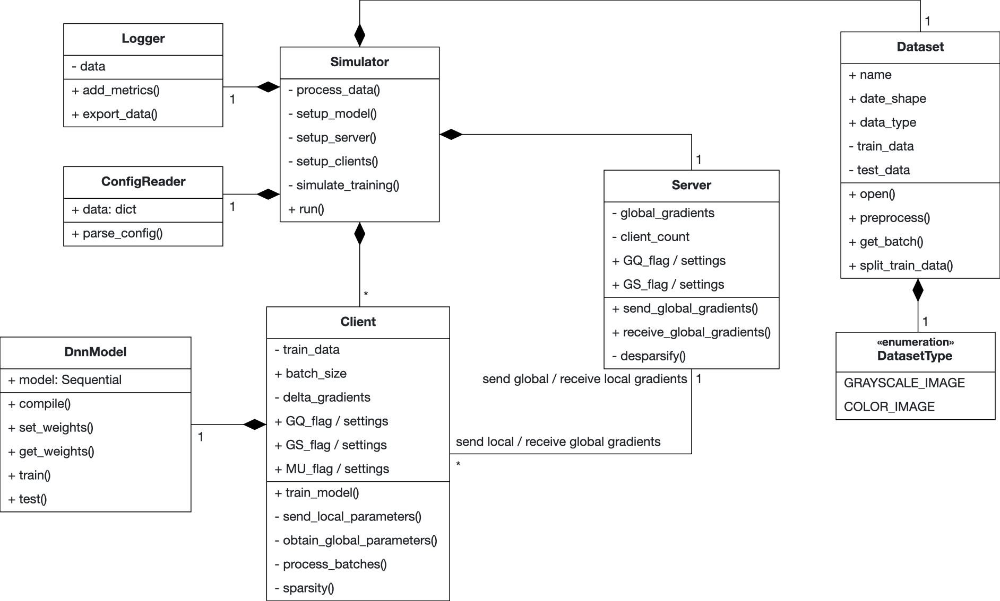

# Communication-efficient approaches to federated deep neural networks (BA thesis)

| <cite>Written by Adrian Henkel, advised by Reza Naserigerdeh and supervised by Dr. Josch Pauling and Prof. Dr. Jan Baumbach.</cite> 

Hey, thank you for being interested in my thesis. 🎉

Please see the slides in the <a href="https://github.com/mainpyp/ComEff/tree/main/presentation">presentation folder</a> to get a quick summary of the work. 
The full thesis can be found here <a href="https://github.com/mainpyp/ComEff/blob/main/Thesis.pdf">here 🤓</a>.

This project aims to simulate and analyse three different communication-efficient approaches for federated machine learning.  
1. _Gradient Quantification_: Each parameter is reduced in its size before sending the gradients to the server and vice versa.
2. _Gradient Sparsification_: This appraoch ignores gradients which have not changed beyond a certain level after the local updates.
3. _Multiple local Updates_: This approach performs the training algorithm mini-batch *SGD* multiple times in one communication round.

All **code** that was used can be found <a href="https://github.com/mainpyp/ComEff/tree/main/python-code">here</a>.  
The **configuration files** for the final simulations can be found <a href="https://github.com/mainpyp/ComEff/tree/main/python-code/configs/final_run">here</a>.  
The **result files** can be found <a href="https://github.com/mainpyp/ComEff/tree/main/storage/produced-data/logs/final_run">here</a>.

Below the package structure is displayed in a truncated UML diagram that focuses on the main functionalities.

This work was graded with a 1.0 (highest grade).
